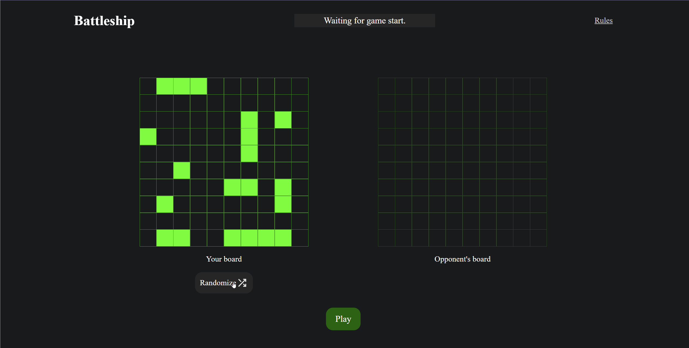

# Battleship

[**Live Preview**](https://alexc2029.github.io/battleship/)

A web-based Battleship game built with vanilla JavaScript to practice Test-Driven Development.

## Features

- **Computer Targeting:** The Computer transitions from random coordinate selection to a queue-based hunting state after landing a successful hit. It initially pushes the four adjacent coordinates to an attack queue. Upon landing a second consecutive hit, it determines the ship's orientation (vertical or horizontal) and targets sequentially along that axis. If an attack along the axis registers a miss or hits a grid boundary, the AI reverses its direction to resume targeting from the opposite side of the initial hit.

- **Randomized Placement:** Populates the gameboard with a standard fleet (sizes 1 through 4) by generating random coordinates and orientations. The algorithm verifies coordinates against grid bounds and enforces a strict one-square buffer zone, ensuring ships do not overlap or touch adjacent ships.

- **Turn Handling:** Implemented a robust turn-handling system which locks user input during the opponent's turn to prevent race conditions and ensure a smooth game loop.

- **Decoupled Architecture:** The core game state (such as Ships, Gameboards, and Players) is independent from the DOM, allowing the game logic to be manipulated and tested in isolation.

## What I learned

- **Test-Driven Development (TDD):** While it slowed me down before I started getting used to it, the TDD approach with Jest forced me to get comfortable with many concepts.
    - **Discipline:** At many points, especially before I got more comfortable with writing tests, I was tempted to just give up and jump into the code. I'm proud to say I mostly resisted those temptations, although I did slip up for one or two minor features for which I wrote some tests only later on.
    - **Mocking & Stubbing:** Since DOM testing was outside the scope of this project, I used `jest.mock()` to intercept my entire DOM controller module so I could test the main game loop without browser APIs interfering. For internal logic, I utilized manual stubs (e.g. `mockSquare = { isHit: jest.fn() }`) to test functions in isolation without needing to instantiate all of their dependencies.
    - **Handling Randomness:** Testing the computer's decisions and the random ship placements initially seemed impossible because the outputs were unpredictable. I learned to use mocking and spying to force the random coordinate generators to return specific values. This allowed me to properly verify logic that used this randomness as a starting point.
    - **Architecture:** Writing tests before implementation naturally forced a decoupled, Object-Oriented design, as I had to ensure all classes could operate and be verified independent of the browser environment.
- **Dependency Injection:** To test complex functions that rely on other methods within the _same module_, I utilized dependency injection. For example, passing `validate = this.areCoordsValid` as a default parameter allowed me to easily mock the validation step during testing.
- **Context Binding (`this`):** When using dependency injection for internal methods, the execution context is lost. I had to manually bind `this` using `.call()` (e.g. `validate.call(this, randomCoords, ...)`) to retain access to the class instance.
- **Array References:** When manipulating coordinates, copying arrays simply by reference caused bugs. I had to use shallow copies (`let coordsCopy = [...coordsArr];`) to safely manipulate the data without altering the original state.
- **Silent Syntax Errors:** JavaScript's forgiving nature made debugging tricky, specifically with silent errors like missing parentheses on function calls, which evaluates the function reference rather than executing it. This was especially frustrating when I forgot parentheses on some test assertions and I didn't realize they were passing without actually running correctly.

## Technologies Used

- Vanilla JavaScript (ES6+)
- Jest (Testing)
- Webpack & Babel (Bundling and Transpiling)
- HTML5 & CSS3

## Future Improvements

- **Drag-and-Drop Placement:** Implement a drag-and-drop interface allowing users to manually position and rotate their fleet on the gameboard prior to the start of a match, providing an alternative to the randomized placement.
- **Computer Ship Size Tracking:** Further enhance the intelligence of the Computer by keeping track of what length ships are already destroyed (e.g if the 4-length ship is already destroyed, stop at 3 hits on the next ships)
